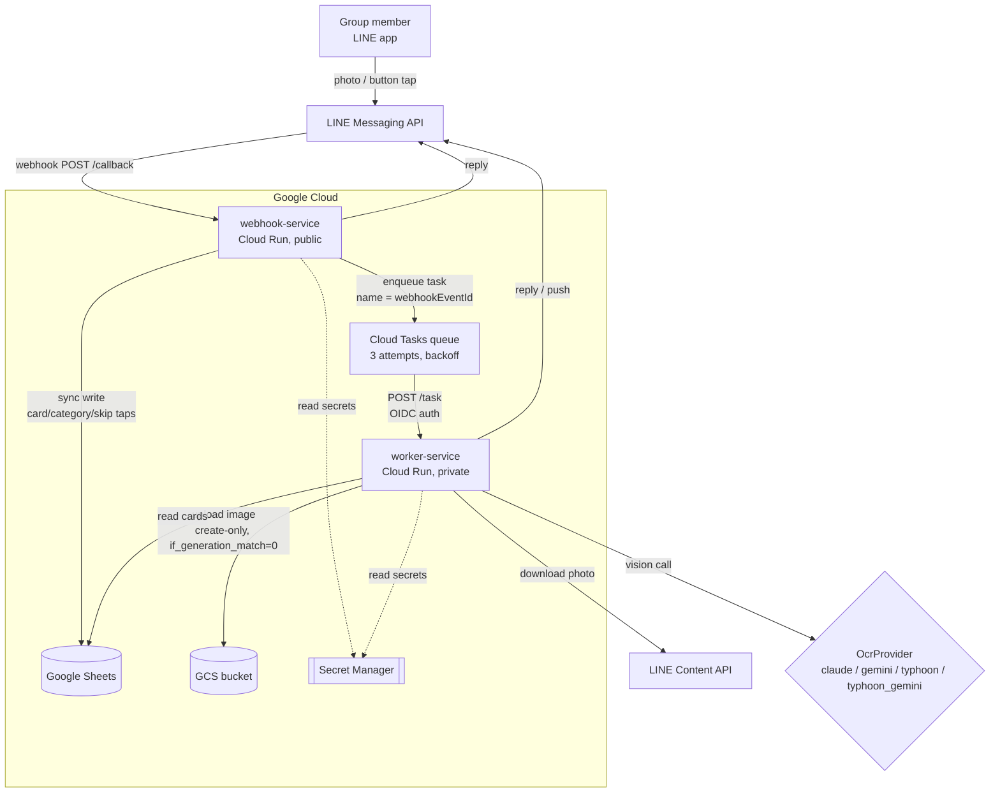

# OCR-credit-card-Line-bot

A small-group expense-tracking bot that runs in one dedicated [LINE](https://line.me) group
chat. Send a photo of a credit-card receipt, tap which card and category it belongs to,
and it lands as a row in a Google Sheet with a proof-of-purchase image link — no manual
data entry.

## Table of contents

- [OCR-credit-card-Line-bot](#ocr-credit-card-line-bot)
  - [Table of contents](#table-of-contents)
  - [Overview](#overview)
  - [Architecture](#architecture)
  - [Event flow](#event-flow)
  - [OCR provider design](#ocr-provider-design)
  - [Security model](#security-model)
  - [Idempotency \& retry policy](#idempotency--retry-policy)
  - [Scale \& cost](#scale--cost)
  - [Multi-tenant design (not built)](#multi-tenant-design-not-built)
  - [Prompt-injection containment](#prompt-injection-containment)
  - [Known limitations](#known-limitations)
  - [Usage notes](#usage-notes)
  - [Future features](#future-features)
  - [Setup guide](#setup-guide)
  - [Model comparison](#model-comparison)
  - [Related docs](#related-docs)

## Overview

Built for a small group (fewer than 10 people) sharing credit cards, in one dedicated
receipts-only LINE group (keeps casual personal photos from ever reaching the OCR call).
A photo comes in, an LLM vision model extracts the merchant/amount/date/last-4-digits,
the sender picks a card and category via tap buttons, and the row is appended to that
card's tab in Google Sheets with a link back to the original photo in Cloud Storage.

It serves two purposes: it's the tool the group actually uses, and it's a deliberately
over-engineered-for-its-scale showcase of production patterns (least-privilege IAM,
infrastructure as code, CI/CD via Workload Identity Federation, idempotent task
processing, structured observability) built to run entirely inside GCP's free tier.
Things a "real" system at this scale would reach for — Kubernetes, Pub/Sub, Redis,
Firestore, an API gateway — are deliberately absent; a handful of users doesn't justify
any of them.

## Architecture

(source: [`receipt_bot_architecture.mermaid`](misc/receipt_bot_architecture.mermaid))

Two Cloud Run services, one queue between them:

- **`webhook-service`** (public, `allow-unauthenticated`) — the only internet-facing
  piece. Verifies LINE's `X-Line-Signature` HMAC on every request; that signature check
  *is* the auth, since LINE calls it as plain HTTPS. Handles fast, synchronous work
  itself (button taps: card/category/skip/cancel, typed-details text messages), and
  enqueues a Cloud Task for anything that needs an OCR call.
- **`worker-service`** (private, invoker-restricted to the runtime service account) —
  does the slow work: downloads the photo from LINE's Content API, uploads it to GCS
  (before OCR — LINE's content expires, GCS is the durable copy), runs it through the
  configured `OcrProvider`, validates the result, and replies.
- **Cloud Tasks queue** sits between them, giving the OCR step retries with backoff
  that a synchronous webhook handler could never have (LINE doesn't redeliver after a
  200 response).
- **Google Sheets** is the system of record — one tab per card, plus a `Cards` meta tab
  and a `Summary` tab. **GCS** stores the receipt photos, linked from each row.
- **Secret Manager** holds every credential (LINE channel secret/token, 3 LLM API
  keys); nothing is baked into the container image or committed to the repo.

## Event flow

Three webhook-triggered actions, one queued:

1. **Image message** → webhook enqueues a Cloud Task → worker downloads the photo,
   uploads it to GCS, runs OCR, validates the extraction against sanity bounds, and
   replies with either a "doesn't look like a receipt" prompt, a "couldn't read this"
   prompt, or card-selection buttons (OCR-matched last-4 ordered first).
2. **Card tapped** → webhook replies with category buttons synchronously (payload
   carries the OCR data forward — no server-side session state).
3. **Category tapped** → webhook replies "Add details?" (`Skip` / `Type details` /
   `Cancel`).
4. **`Skip` tapped, or typed-details text received** → webhook builds the final row and
   appends it to that card's tab, replies `Recorded ✓ <merchant> — <amount>`.

`Process anyway` (on a misclassified receipt) reuses the extraction already in the
payload — no second LLM call. `Cancel`, available at every step, ends the flow with
nothing written and cleans up the orphaned GCS upload. That cleanup isn't special to
Cancel: every dead-end reply that leaves no further buttons to tap — unreadable OCR
output, a bounds-violation ("resend the photo"), a bounds-blocked `Process anyway`, or
Cloud Tasks giving up after 3 retries — deletes the uploaded photo too, since no sheet
row will ever reference it.

| Input | Bot reaction |
|---|---|
| Valid receipt photo | Extracted merchant + amount shown, card buttons (last-4 match ordered first) |
| Installment slip (ผ่อนชำระ/IPP/Smart Pay) | Same, but `amount` = the TOTAL purchase, not the monthly figure; term appended to `details` |
| Blurry / dark / rotated / oversized / corrupt photo | One attempt, no retries — "Couldn't read that photo" or a bounds-violation message, optionally with a targeted retake tip (e.g. "the photo looks blurry"); photo deleted either way |
| Non-receipt photo (pet, selfie, screenshot) | "Doesn't look like a receipt" + `Process anyway` button; one LLM call either way, no row unless tapped |
| 3+ photos sent as a batch | 3 independent prompts, each with its own merchant/amount; each completes to its own row (LINE only shows quick-reply buttons on the newest message — completing an earlier prompt first is the practical order) |
| Duplicate webhook delivery (same `webhookEventId`) | Collapsed at the Cloud Tasks layer (`AlreadyExists`) — exactly one task, one OCR call, one row |
| Plain text / sticker / video / PDF | Ignored silently (no LLM call, no reply) |
| `Cancel` tapped at any step | "Cancelled — `
`" reply, nothing written, GCS upload deleted |
| System failure (expired API key, quota, provider outage) | Up to 3 Cloud Tasks retries, then "Something went wrong — please resend that."; photo deleted once retries are exhausted |
| Image from a non-allowlisted group | Rejected at the webhook (before any LLM call), group ID logged so the owner can allowlist it, no reply |

Full breakdown of every abnormal-photo scenario and its classification (user-fixable vs.
needs-the-owner) is in [`docs/abnormal_photo_scenarios.md`](docs/abnormal_photo_scenarios.md).

## OCR provider design

OCR is swappable behind one interface, `OcrProvider.extract(image: bytes) -> dict`, via
the `OCR_MODEL` env var. Four providers exist, and the interface deliberately hides very
different internals behind that one method:

- **`claude`** (default) — a single instructable vision call (`claude-haiku-4-5`). The
  model is told the exact JSON shape to return, including the Buddhist-Era-to-CE date
  conversion and the installment-total rule, in one prompt.
- **`gemini`** — same shape, single call, different vision model
  (`gemini-3.1-flash-lite`) — a genuinely free-tier path, useful when Anthropic billing
  isn't configured.
- **`typhoon`** — Typhoon's OCR model is a *fixed-prompt* document extractor: it can't
  be instructed to return custom structured fields, only raw markdown text. So this
  provider is two calls: Typhoon image→markdown, then a second, cheap Claude Haiku
  call to parse that markdown into the same JSON shape every other provider returns.
- **`typhoon_gemini`** — same two-step shape as `typhoon`, but Gemini replaces Claude
  Haiku for the parse step — the only fully Anthropic-free two-step path.

All four return the exact same dict shape, validated by one Pydantic model
(`ReceiptExtraction`) regardless of which provider produced it — callers never know or
care which one ran.

**Why `is_receipt` + a `Process anyway` button, instead of the two obvious
alternatives:** "trust the model's classification blindly" risks silently dropping a
real receipt the model misjudged as junk, with no recovery path. "Ask the user to
confirm every single photo is a receipt" adds a tap to the common case for no reason.
Having the model self-report `is_receipt` and letting a human override it with one tap
gets both: the model still does the classification work (zero extra LLM cost either
way — the extraction already ran), but a human can always correct it, and the failure
mode of a wrong classification is one extra button tap, not a silently dropped receipt
or a silently wrong row.

## Security model

Three identities, each scoped to exactly what it needs:

| Identity | Role | Can do | Cannot do |
|---|---|---|---|
| **Owner** (you) | Local bootstrap only | `terraform apply`, one local `key.json` for the runtime SA (dev/bootstrap use only) | Isn't used by any running service — CI/CD and Cloud Run never use this identity |
| **`github-actions-deployer`** (CI/CD) | Ships code | `roles/run.developer`, `roles/artifactregistry.writer` (scoped to the one repo), `roles/iam.serviceAccountUser` on the runtime SA only (lets it deploy code that *runs as* the runtime SA, without ever holding the runtime SA's own data permissions) | No Sheets access, no secrets access — "cannot touch data" is enforced by omission, not a policy layer |
| **`line-receipt-bot`** (runtime) | Touches data | `roles/cloudtasks.enqueuer` (one queue), `roles/run.invoker` (worker-service only, not project-wide), `roles/secretmanager.secretAccessor` per secret (5 individual bindings, not a blanket grant), a **custom `receiptImageWriter` role** (`storage.objects.create` + `storage.objects.delete` only — no read, no list), Sheets access via manual Editor sharing (not project IAM) | Cannot deploy code, cannot change any IAM binding |

Authentication has no long-lived Google credential in CI: GitHub Actions authenticates
via **Workload Identity Federation** — GitHub's own OIDC token is exchanged for
short-lived GCP credentials at run time, scoped by an `attribute_condition` to exactly
one GitHub repository (required by Google; without it, any repo could mint tokens
against the pool). Cloud Run itself needs no key file at all — both services run as the
`line-receipt-bot` SA via its attached identity.

Every secret (LINE channel secret/token, 3 LLM API keys) lives in Secret Manager,
mounted as env vars, each with its own individual `secretAccessor` binding rather than
one broad grant.

## Idempotency & retry policy

The idempotency key everywhere is the LINE **`webhookEventId`**, used as the Cloud Tasks
task name. Two separate retry mechanisms sit on either side of that key:

1. **Webhook → Cloud Tasks enqueue** (`app/tasks.py`): a bounded 2-attempt in-process
   retry for transient gRPC errors — this is the *only* retry this hop gets, since LINE
   never redelivers after a 200 response. If the same task name is submitted twice
   (e.g. attempt 1 actually succeeded server-side but the response was lost), Cloud
   Tasks itself returns `AlreadyExists`, logged as a collapsed duplicate, not an error.
2. **Cloud Tasks → worker delivery**: the queue's own `retry_config` — 3 attempts,
   10s–300s exponential backoff — for genuinely transient failures on the OCR/reply
   path. Content-shaped failures (`OcrContentError`: unrecoverable OCR output, or a
   provider deterministically rejecting the image) are **never retried** — they reply
   once and return 200, since retrying the same image reproduces the same failure.

A third, independent safety net lives at the write itself: `SheetsStore.append_receipt`
checks the target tab for an existing row with the same `message_id` before writing,
skipping (not erroring) if one's already there — so even a duplicate write attempt that
somehow got past both task-name layers can't produce a second row.

Full failure-mode breakdown (which errors retry vs. reply-and-stop vs. need the owner's
attention): [`docs/abnormal_photo_scenarios.md`](docs/abnormal_photo_scenarios.md).

## Scale & cost

Both services are stateless — all state either rides inside a LINE postback's `data`
field (the pending receipt's fields, pipe-delimited with per-field percent-escaping —
chosen over base64/URL-encoding because Thai text would balloon 4–9x under those,
against LINE's 300-character limit) or lives in Sheets/GCS. `max-instances=3` on both
Cloud Run services is a **deliberate cost guardrail**, not a real scale need at this
user count (fewer than 10). The documented
bottleneck at any real scale would be Google Sheets' own write-quota (roughly 60
writes/min per the design notes) — the `ReceiptStore` interface exists specifically so
a future migration off Sheets doesn't touch any business logic, just a new
implementation of two methods.

Cost, entirely on GCP's free tier except the LLM API:

| Item | Cost |
|---|---|
| Cloud Run, Cloud Tasks, GCS, Secret Manager | $0 (free tier at this volume) |
| Google Sheets | $0 |
| LLM vision call (Claude Haiku, per photo) | ~$0.002–0.004 |
| **Total, 50–150 receipts/month** | **~$0.15–0.60/month** |

Every photo that reaches the bot costs exactly one LLM call, receipt or not — the
dedicated group is the volume control, `is_receipt` is the backstop.

## Multi-tenant design (not built)

Deliberately unbuilt — the checklist calls this out as a design exercise, not a
roadmap item. This bot hardcodes a single tenant: one `ALLOWED_GROUP_ID`, one Sheet, one
GCS bucket. Supporting multiple independent groups would need:

- `ALLOWED_GROUP_ID` (single value) → a lookup table (group ID → tenant config), likely
  a small Firestore/Sheets-backed mapping rather than another env var per tenant.
- Either a separate Sheet + bucket per tenant (simplest, matches the current
  single-Sheet-per-group model, but doesn't scale past a handful of tenants), or a
  shared Sheet/bucket with a tenant partition key on every row/object name.
- Per-tenant secret isolation if tenants ever bring their own LINE channel — currently
  one LINE channel serves the one group.
- The OCR provider seam and the `ReceiptStore`/`ImageStore` interfaces already support
  this without changes — the tenant-scoping work is entirely in routing and storage
  keys, not in the extraction or business logic.

## Prompt-injection containment

Receipt text is untrusted input to an LLM — a malicious or corrupted receipt image
could contain text designed to hijack the extraction prompt. Containment is structural,
not prompt-based:

- The OCR call has **no tools** — there's nothing for an injected instruction to invoke.
- Output is constrained to **JSON-only**; anything else (prose, a refusal, injected
  instructions echoed back) fails `parse_llm_json` and becomes an `OcrParseError`
  (content error, reply-and-stop, no retry).
- `ReceiptExtraction` + `check_bounds` reject anything that doesn't fit the expected
  shape or plausible ranges (amount `0 < x ≤ 100,000`, date within ‑90/+1 days) — a
  successfully-injected fake "amount" or "merchant" still has to pass these bounds to
  ever reach a Sheet row.
- Worst case, if all of that is somehow defeated: one wrong row, visible to the sender
  before it's written (every extraction is shown for confirmation), cancellable at any
  step, and traceable by `message_id` in the logs.

## Known limitations

- A receipt split across two photos isn't supported — each half independently fails
  the amount/date bounds check rather than being recognized as a partial submission.
- Duplicate *content* (the same physical receipt photographed and sent twice as two
  separate messages) isn't deduped by code — different `messageId`s look like two
  different receipts; a human cancels one. (This is distinct from duplicate *delivery*
  of the same message, which the idempotency layer above does handle.)
- Non-receipt images still cost one LLM call each — the dedicated group is the
  mitigation, `is_receipt` is the backstop, not a pre-filter.
- Installment totals are recorded once, at purchase date — monthly Sheet totals won't
  match the card statement during an active installment period (the alternative,
  scheduling monthly rows, was rejected as needing infra this project deliberately
  doesn't have).
- A longer tail of image-quality issues (multiple receipts in one photo, faded thermal
  paper, heavy compression artifacts) isn't specially handled — see
  [`docs/abnormal_photo_scenarios.md`](docs/abnormal_photo_scenarios.md)'s "not
  addressed" section for the full list and why they're an accepted risk at this scale.
- A "Doesn't look like a receipt" prompt that nobody ever taps (`Process anyway` or
  `Cancel`) leaves its photo in the bucket — whether a tap is still coming is unknowable
  server-side, so there's no safe moment to clean it up. Same 7-day soft-delete safety
  net as every other orphaned-photo case; no automatic sweep exists.

## Usage notes

(Pinned in the group chat)

- One photo per receipt; make sure the whole receipt is visible in frame.
- Captions are ignored — category comes from the buttons after you send the photo.
- Stickers, videos, and PDFs are ignored silently — only photos trigger a response.
- Every photo ends in either "Recorded ✓" or an error message. If neither shows up,
  resend the photo.
- Only receipts belong in this group — anything else still costs a small LLM call.

## Future features

**Image pre-processing before OCR** — a cheap, deterministic cleanup pass (deskew,
crop-to-receipt, contrast/exposure normalization, denoise) run on the photo before it
reaches the vision model, targeting the "longer tail of image-quality issues" in
[Known limitations](#known-limitations) (faded thermal paper, heavy compression
artifacts, mild blur/rotation) that currently fall straight through to a "couldn't read
that photo" reply. Worth measuring against `scripts/compare_models.py`'s methodology
before committing to it — the OCR models may already be robust enough that a
pre-processing step buys little accuracy for the added latency and code surface. Not
built.

## Setup guide

Condensed from the build log's Tasks 2–4 — enough to stand this up from scratch:

1. **Google Sheet**: create tabs `Card_A1`, `Card_A2`, `Card_B1` (one per physical
   card, name however you like), `Cards` (meta: `card_id | bank | card_name | last4 |
   expiry | status`), `Summary` (leave empty until real rows exist). Each card tab
   header: `date | card | category | amount | details | receipt_link | year | month |
   submitted_by | ocr_model | message_id | created_at`. Share the sheet Editor access
   with the runtime service account's email once it exists.
2. **GCP project**: create it, link billing (required even to stay inside free tier),
   enable `cloudresourcemanager.googleapis.com` + `serviceusage.googleapis.com` (needed
   before Terraform can enable anything else), `gcloud auth application-default login`.
3. **LINE Developers console**: create a provider + Messaging API channel, copy the
   channel secret and access token into `.env`, enable "Allow bot to join group chats",
   disable the default auto-reply/greeting messages, create the dedicated receipts-only
   group and invite the bot.
4. **Terraform**: `cd infra && terraform init && terraform apply` (see
   `terraform.tfvars.example` for every variable) — provisions the GCS bucket, service
   accounts, IAM bindings, Secret Manager containers, Cloud Tasks queue, and (once
   `deploy_services = true`) both Cloud Run services. Add real secret values manually
   post-apply via `gcloud secrets versions add <name> --data-file=-`.
5. **Wire-up**: paste the deployed webhook URL into the LINE console and verify; send
   any message in the group, copy the logged (rejected) group ID into
   `ALLOWED_GROUP_ID`, redeploy.
6. **CI/CD**: push to `main` — `.github/workflows/deploy.yml` runs the test suite,
   builds the image, and deploys both services via Workload Identity Federation, no
   stored credentials.

## Model comparison

`OCR_MODEL=claude` is the current production default — but that was a **billing-
availability decision**, not a quality-backed one: `gemini` was the interim default
while Anthropic billing was unconfigured, and the switch happened purely because
billing became available. The tooling and methodology to actually measure field-level
and `is_receipt` accuracy across all four providers exists
(`scripts/compare_models.py`), but the real comparison run — gathering real receipt
photos, building ground truth, scoring — hasn't happened yet.

Full methodology, and results once run: [`docs/ocr_model_comparison.md`](docs/ocr_model_comparison.md).

## Related docs

- [`docs/abnormal_photo_scenarios.md`](docs/abnormal_photo_scenarios.md) — every
  abnormal-photo scenario (blurry, rotated, oversized, corrupt, provider outages, …),
  what the bot does about each, and whether it's user-fixable or needs the owner.
- [`docs/ocr_model_comparison.md`](docs/ocr_model_comparison.md) — OCR provider
  comparison methodology and (pending) results.
